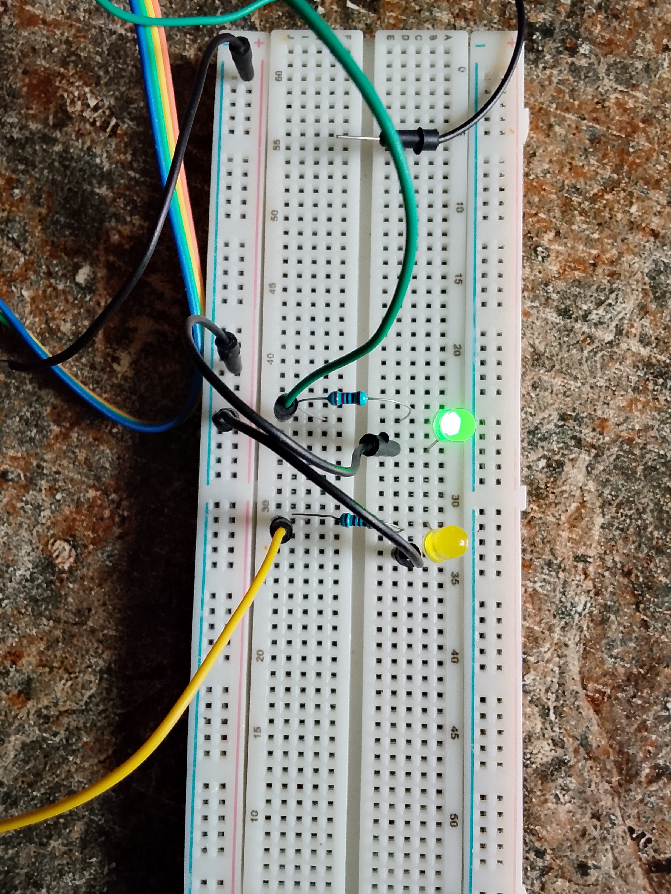

## Dual LED Alternate Blink Using STM32F401CCU6 Black Pill

## Overview

This project demonstrates how to control multiple GPIO output pins on the **STM32F401CCU6 Black Pill Development Board** using **bare-metal (register-level) programming** without relying on STM32 HAL libraries.

Two external LEDs are connected to separate GPIO pins and are programmed to blink alternately, producing a police-light effect.

---

## Objectives

* Learn how to configure multiple GPIO pins as outputs.
* Understand direct register manipulation in STM32 microcontrollers.
* Practice bit masking techniques.
* Gain experience with timing delays and continuous execution loops.

---

## Hardware Used

| Component                      | Quantity    |
| ------------------------------ | ----------- |
| STM32F401CCU6 Black Pill Board | 1           |
| Yellow LED                     | 1           |
| Green LED                      | 1           |
| 220Ω Resistor                  | 2           |
| Breadboard                     | 1           |
| Jumper Wires                   | As required |

---

## Software Used

* STM32CubeIDE
* Embedded C Programming Language
* ST-Link Programmer/Debugger

---
## Project Code

[Click Here to check out the project code](codes)

## Project Image




## Program Demostration video

[Click here to check out the Demo_video](https://youtu.be/T2isDlYm-ZQ)


## Expected Output

The LEDs blink alternately as shown below:

```text
Red LED   : ON   OFF   ON   OFF ...
Blue LED  : OFF  ON    OFF  ON  ...
```

This creates a flashing police-light effect.

---

## Concepts Learned

* GPIO Configuration
* Register-Level Programming
* Bit Manipulation and Masking
* Embedded Timing Delays
* Infinite Loop Execution
* Multiple Output Control

## Repository Structure

```text
Project/
│── Core/
│   ├── Inc/
│   └── Src/
│── README.md
│── .project
│── .cproject
```

---

## Author

**Moses Kolawole**
Electrical and Electronics Engineering Student
Federal University of Technology, Minna (FUTMINNA)

**Interests:** Embedded Systems, Embedded AI, Robotics, and Automotive Systems.
